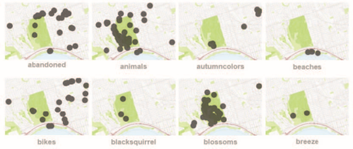
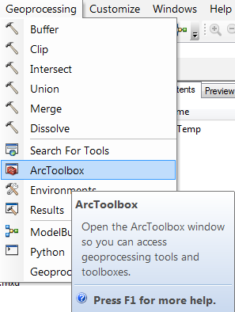
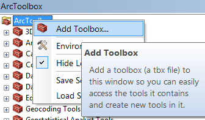
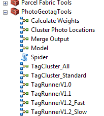
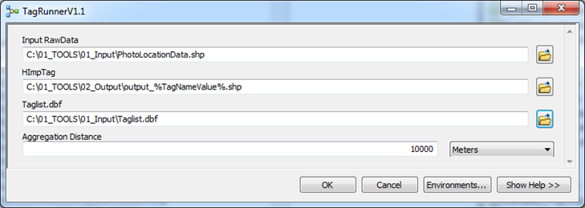

ArcGIS PHOTO GEOTAG TOOLS
====================

PHOTO GEOTAG TOOLS Tools is a collection of tools for processing and clustering photo metadata to generate Tag Maps and [similar Visualizations](https://www.flickr.com/photos/64974314@N08/albums/72157628868173205):

* **Tagrunner All/Standard:** This tool will cluster photo locations, calculate statistics (photos/ user numbers per cluster) and generate Alpha Shapes for the placement of labels.

* **Cluster Photo Locations:** This Tool will cluster large point datasets and calculate basic statistics. Output is a point shapefile.
	This is an example of different photo locations clustered at Toronto High Park:
	
	
* **Calculate Weights:** This is a Python based Model Builder script that runs a Weighting Algorithm to calculate a) a weighted number between photo count/ user count and b) to calculate the single densest cluster per tag ('HImP').
	The following weighting formulas have been tested:
	*  `1+ [Join_Count] *(sqr(1/( [Join_Count] / [COUNT_User] )^3)) ` → Standard weighting formula
	* `1+ [Join_Count] *(sqr(1/( [Join_Count] / [COUNT_User] )^2)) ` → less importance on User_Count in comparison to photo count `[Join_Count]`
	* `sqr(([Join_Count]+(2*sqr([Join_Count])))*2) ` → Ignores User_Count, this will emphasize individual and very active users
	
This tool has been successfully tested in ArcMap 10.4. 

## Download & Install

1. Download the [PhotoGeotagTools_V3.0](PhotoGeotagTools_V3.0.tbx) Toolbox

2. Move the *.tbx file to the directory where you want to store the toolbox. Recommended: ***C:/01_TOOLS/***
 

3. Open ArcCatalog, and click Geoprocessing > ArcToolbox.

	

5. Right-click on ArcToolbox, and click Add Toolbox.

	

6. In the Add Toolbox window, click the Connect to Folder icon and navigate to the location of the toolbox. Select the PhotoGeotagTools_V3.0.tbx file and click Open. The PhotoGeotagTools Toolbox appears in the ArcToolbox window.

	

7. Start using the PhotoGeotagTools Toolbox!

	

## Other Important Downloads

This is a youtube turotial/workshop that guides through the generation of Flickr tag maps, which includes the use of ArcGIS PHOTO GEOTAG TOOLS:

* [Youtube Workshop](https://www.youtube.com/watch?v=3K_oVk4vhHE)

The following two tools are also required for the Workshop

* [01 ClipGeo](https://github.com/Sieboldianus/ClipGeo)

* [02 Access Photo Database Interface](https://github.com/Sieboldianus/AccessPhotoDatabaseInterface)

## Contributors

Special thanks to Chris from Stack Exchange who helped [refining the Clustering Process in Model Builder](http://gis.stackexchange.com/questions/103954/counting-unique-occurrences-during-spatial-join).

## License

GNU GPLv3

PHOTO GEOTAG TOOLS V3.0 can be downloaded and used by anyone. Please share your updates.
